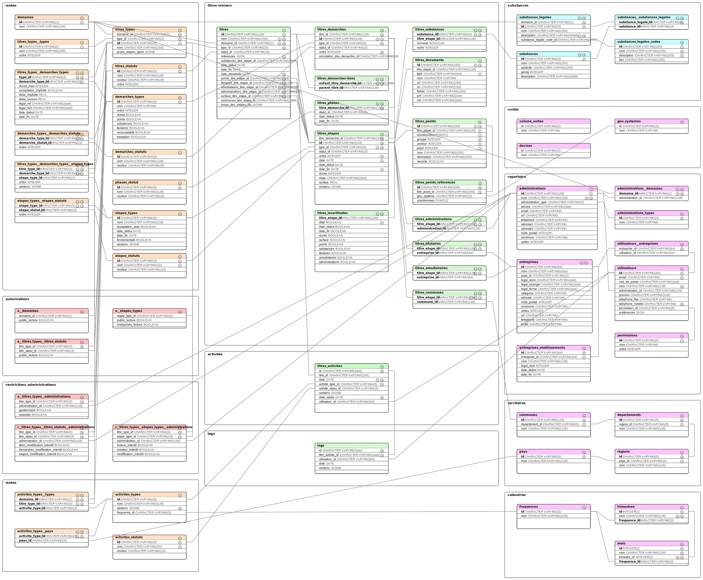

# Camino API

[![Build Status][ci-img]][ci] [![codecov][codecov-img]][codecov] [![Dependency Status][dep-img]][dep]

[ci-img]: https://travis-ci.org/MTES-MCT/camino-api.svg?branch=master
[ci]: https://travis-ci.org/MTES-MCT/camino-api
[codecov-img]: https://codecov.io/gh/MTES-MCT/camino-api/branch/master/graph/badge.svg
[codecov]: https://codecov.io/gh/MTES-MCT/camino-api
[dep-img]: https://david-dm.org/MTES-MCT/camino-api.svg
[dep]: https://david-dm.org/MTES-MCT/camino-api

> API GraphQL de [Camino](http://camino.beta.gouv.fr/): [api.camino.beta.gouv.fr](https://api.camino.beta.gouv.fr)

---

## Technologies

- [Node.js](https://nodejs.org/)
- [Express.js](http://expressjs.com)
- [PostgreSQL](https://www.postgresql.org/)
- [Express-GraphQL](https://github.com/graphql/express-graphql)
- [Knex.js](https://knexjs.org/)
- [Objection.js](http://vincit.github.io/objection.js/)
- [Eslint](https://eslint.org/)
- [Prettier](https://prettier.io/)
- [Standardjs](https://standardjs.com/)
- [Docker](https://www.docker.com/)

---

## Environnement

Pour que l'application fonctionne, sont requis:

- Node.js (v.10 ou plus) et npm
- Une base de données PostgreSQL (v.10 ou plus)

---

## Configuration et imports des données

- Cloner ce repo : `git clone https://github.com/MTES-MCT/camino-api.git`
- Créer une base de données PostgreSQL nommée `camino`.
- Renommer le fichier `.env-example` en `.env` et le compléter.

### Installation

```bash
# installe les dépendances
npm install
```

```bash
# compile l'application avec typescript
npm run build

# importe les données depuis /database/camino-public.sql
npm run db:import

# crée un utilisateur admin
npm run user-add
```

### Développement

```bash
# démarre le serveur avec nodemon
npm run dev
```

### Production

```bash
# démarre le serveur
npm run start
```

---

## Tests

```bash
# lance les tests en local
npm run jest
```

---

## Structure des fichiers

```bash
.
├── docs                 # `documentation et exemples`
│
├── knex                 # `scripts de création et d'import de la base de données (npm run migrate)
│   ├── migrations       # `création de la base de données`
│   └── seeds            # `import depuis les fichier /sources vers la base de données`
│
├── sources              # `sources de la base de données au format json. Générées avec npm run import.`
│
└── src                  # `fichiers sources. Transformés avec npm run build.`
    ├── index            # `point d'entrée`
    │
    ├── api              # `API graphql`
    │   ├── resolvers    # `liens entre l'API et la base de données`
    │   ├── schemas      # `description des nœuds de l'API`
    │   └── types        # `types graphQl customs`
    │
    ├── config           #
    │   ├── index        # `variables globales`
    │   └── knex         # `connexion à la base de données`
    │
    ├── database         # `base de données PostgreSQL`
    │   ├── models       # `modèles de la base de données (knex.js / objection.js)`
    │   └── queries      # `requêtes à la base de données (knex.js / objection.js)`
    │
    ├── business         # `logique métier`
    │   ├── processes    # `scripts de traitement`
    │   ├── queries      # `requêtes de mise à jour`
    │   ├── rules        # `lois et procédures administratives`
    │   ├── utils        # `utilitaires de filtrage et de classement`
    │   ├── daily        # `scripts de mise à jour quotidiens (npm run daily)`
    │   ├── etape-update # `script effectués lors de la mise à jour d'une étape`
    │   └── monthly      # `scripts de mise à jour mensuels (npm run monthly)`
    │
    └── tools            # `outils`
        ├── dev          # `outils de développement`
        ├── export       # `exportation de la base de données vers des spreadsheets (npm run export)`
        ├── import       # `import de spreadsheets vers des fichiers json dans /sources (npm run import)`
        ├── api-...      # `connexion aux api externes`
        └── emails-send  # `envoi d'email`

```

---

## PostgreSQL



---

## Contribution

Voir [contributing.md](contributing.md) (en anglais) pour plus d'infos.

---

## Crédits

### Production

- [La Fabrique Numérique, Ministère de la transition écologique et solidaire](https://www.ecologique-solidaire.gouv.fr/inauguration-fabrique-numerique-lincubateur-des-ministeres-charges-lecologie-et-des-territoires)

### Équipe

- Guillaume Levieux, intrapreneur
- Joeffrey Arruyer, coach
- [François Romain](http://francoisromain.com), développeur
- [Adrien Risser](https://github.com/risseraka), développeur

---

## Licence

Camino API, le cadastre minier numérique ouvert

[AGPL 3 ou plus récent](https://spdx.org/licenses/AGPL-3.0-or-later.html)
