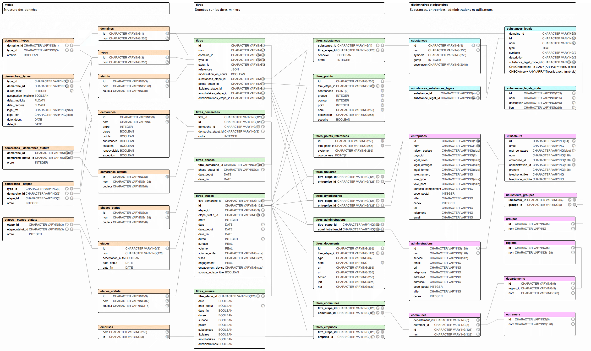

# Camino API

> API GraphQL de [Camino](http://camino.beta.gouv.fr/)

---

## Technologies

- Node.js
- Express.js
- PostgreSQL
- Express-GraphQL
- Knex.js
- Objection.js
- Eslint
- Prettier
- Standardjs

---

## Configuration et imports des données

- Requiert Node.js, npm et une base de données PostgreSQL.
- Renommer le fichier `.env.example` en `.env` et le compléter.

```bash
# installe les dépendances
npm install

# importe les données au format .json
# depuis google spreadsheets vers './_tools/sources'
npm run import

# crée les tables dans la base de données
# et importe les données depuis './_tools/sources'
npm run migrate
```

---

## Développement

```bash
# démarre le serveur avec nodemon
npm run dev
```

---

## Docker

### Environnement de développement

Pour développer sans installer PostgreSQL localement.

```bash
# démarre l'application et la base de données dans des conteneurs Docker
# en mode `development`
# accessible à http://localhost:NODE_PORT
docker-compose -f ./docker-compose.localhost.yml up --build
```

### Environnement de test

Pour tester l'application en local dans un environnement de production

Pré-requis:

- une installation locale active de https://github.com/jwilder/nginx-proxy
- un certificat ssl auto-signé
- [instructions](https://medium.com/@francoisromain/set-a-local-web-development-environment-with-custom-urls-and-https-3fbe91d2eaf0)

```bash
# démarre l'application et la base de données dans des containers Docker
# en mode `production`
# accessible à https://api.camino.local
docker-compose -f ./docker-compose.local.yml up --build
```

### Environnement de production

Pré-requis:

- une installation active de https://github.com/jwilder/nginx-proxy
- [instructions](https://medium.com/@francoisromain/host-multiple-websites-with-https-inside-docker-containers-on-a-single-server-18467484ab95)

```bash
# démarre l'application et la base de données dans des containers Docker
# en mode `production`
# accessible à http://api.camino.beta.gouv.fr
docker-compose -f ./docker-compose.prod.yml up -d --build
```

---

## PostgreSQL



---

## Contribution

Voir [contributing.md](contributing.md) (en anglais) pour plus d'infos.

---

## Crédits

### Production

- [La Fabrique Numérique, Ministère de la transition écologique et solidaire](https://www.ecologique-solidaire.gouv.fr/inauguration-fabrique-numerique-lincubateur-des-ministeres-charges-lecologie-et-des-territoires)

### Équipe

- Guillaume Levieux, intrapreneur
- Joeffrey Arruyer, coach
- [François Romain](http://francoisromain.com), développeur

---

## Licence

Camino API, le cadastre minier numérique ouvert

[AGPL 3 ou plus récent](https://spdx.org/licenses/AGPL-3.0-or-later.html)
