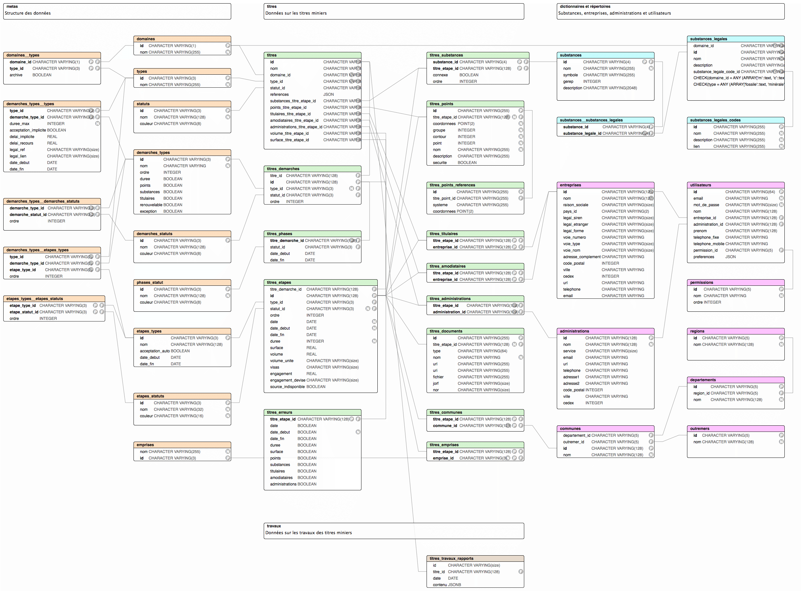

# Camino API

[](https://travis-ci.org/MTES-MCT/camino-api)

> API GraphQL de [Camino](http://camino.beta.gouv.fr/): [api.camino.beta.gouv.fr](https://api.camino.beta.gouv.fr)

---

## Technologies

- [Node.js](https://nodejs.org/)
- [Express.js](http://expressjs.com)
- [PostgreSQL](https://www.postgresql.org/)
- [Express-GraphQL](https://github.com/graphql/express-graphql)
- [Knex.js](https://knexjs.org/)
- [Objection.js](http://vincit.github.io/objection.js/)
- [Eslint](https://eslint.org/)
- [Prettier](https://prettier.io/)
- [Standardjs](https://standardjs.com/)
- [Docker](https://www.docker.com/)

---

## Environnement

Pour que l'application fonctionne, sont requis:

- Node.js (v.10 ou plus) et npm
- Une base de données PostgreSQL (v.10 ou plus)

---

## Configuration et imports des données

- Créer une base de données `camino`.
- Renommer le fichier `.env.example` en `.env` et le compléter.

```bash
# installe les dépendances
npm install

# importe les données au format .json
# depuis google spreadsheets vers './tools/sources'
npm run import

# crée les tables dans la base de données
# et importe les données depuis './tools/sources'
npm run migrate

# met à jour les données
npm run daily
```

---

## Développement

```bash
# démarre le serveur avec nodemon
npm run dev
```

---

## Tests

```bash
# lance les tests
npm run test
```

---

## Docker

### Environnement de développement

Pour développer sans installer PostgreSQL localement.

```bash
# démarre l'application et la base de données dans des conteneurs Docker
# en mode `development`
# accessible à http://localhost:NODE_PORT
docker-compose -f ./docker-compose.localhost.yml up --build
```

### Environnement de test

Pour tester l'application en local dans un environnement de production

Pré-requis:

- une installation locale active de https://github.com/jwilder/nginx-proxy
- un certificat ssl auto-signé
- [instructions](https://medium.com/@francoisromain/set-a-local-web-development-environment-with-custom-urls-and-https-3fbe91d2eaf0)

```bash
# démarre l'application et la base de données dans des containers Docker
# en mode `production`
# accessible à https://api.camino.local
docker-compose -f ./docker-compose.local.yml up --build
```

### Environnement de production

Pré-requis:

- une installation active de https://github.com/jwilder/nginx-proxy
- [instructions](https://medium.com/@francoisromain/host-multiple-websites-with-https-inside-docker-containers-on-a-single-server-18467484ab95)

```bash
# démarre l'application et la base de données dans des containers Docker
# en mode `production`
# accessible à http://api.camino.beta.gouv.fr
docker-compose -f ./docker-compose.prod.yml up -d --build
```

---

## Structure des fichiers

```bash
.
├── index.js                    # `point d'entrée`
│
├── api                         # `API graphql`
│   ├── resolvers               # `liens entre l'API et la base de données`
│   ├── schemas                 # `description des nœuds de l'API`
│   └── types                   # `types graphQl customs`
│
├── config                      #
│   ├── index.js                # `variables globales`
│   └── knex.js                 # `connexion à la base de données`
│
├── database                    # `base de données PostgresQL`
│   ├── models                  # `modèles de la base de données (knex.js / objection.js)`
│   └── queries                 # `requêtes à la base de données (knex.js / objection.js)`
│
├── docs                        # `documentation et exemples`
│
├── tasks                       # `logique métier`
│   ├── _utils                  # `scripts de mise à jour de la base de données`
│   ├── daily                   # `scripts quotidiens (npm run daily)`
│   └── etape-update            # `script effectués lors de la mise à jour d'une étape`
│
└── tools                       # `outils`
    ├── export                  # `exportation de la base de données vers des spreadsheets (npm run export)`
    ├── import                  # `import de spreadsheets vers des fichiers json dans /sources (npm run import)`
    ├── knex                    # `scripts de création et d'import de la base de données (npm run migrate)`
    │   ├── migrations          # `création de la base de données`
    │   └── seeds               # `import depuis les fichier /sources vers la base de données`
    ├── mailer                  # `utilitaire d'envoi d'email (Nodemailer)`
    ├── sources                 # `données sources sous forme de fichiers json`
    └── utils                   #

```

---

## PostgreSQL



---

## Contribution

Voir [contributing.md](contributing.md) (en anglais) pour plus d'infos.

---

## Crédits

### Production

- [La Fabrique Numérique, Ministère de la transition écologique et solidaire](https://www.ecologique-solidaire.gouv.fr/inauguration-fabrique-numerique-lincubateur-des-ministeres-charges-lecologie-et-des-territoires)

### Équipe

- Guillaume Levieux, intrapreneur
- Joeffrey Arruyer, coach
- [François Romain](http://francoisromain.com), développeur

---

## Licence

Camino API, le cadastre minier numérique ouvert

[AGPL 3 ou plus récent](https://spdx.org/licenses/AGPL-3.0-or-later.html)
