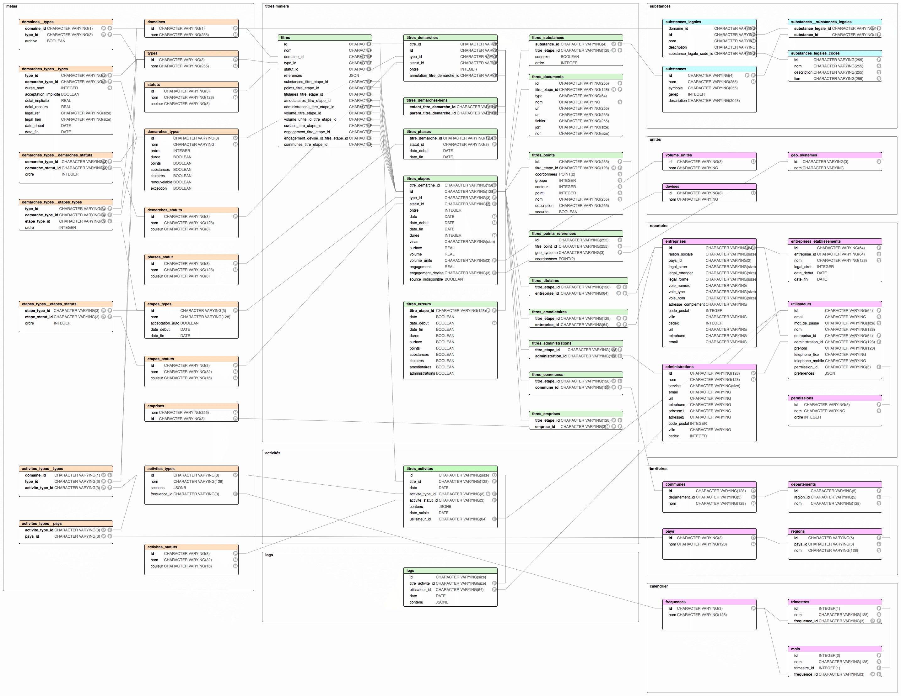

# Base de données Camino

L'Api Camino fonctionne avec une base de données PostgreSQL.



```sh
# faire un dump depuis la base de données locale
pg_dump -c -d camino --username=postgres -h localhost -f camino.dump

# importer un dump
psql -d camino --username=postgres -h localhost < camino.dump
```
