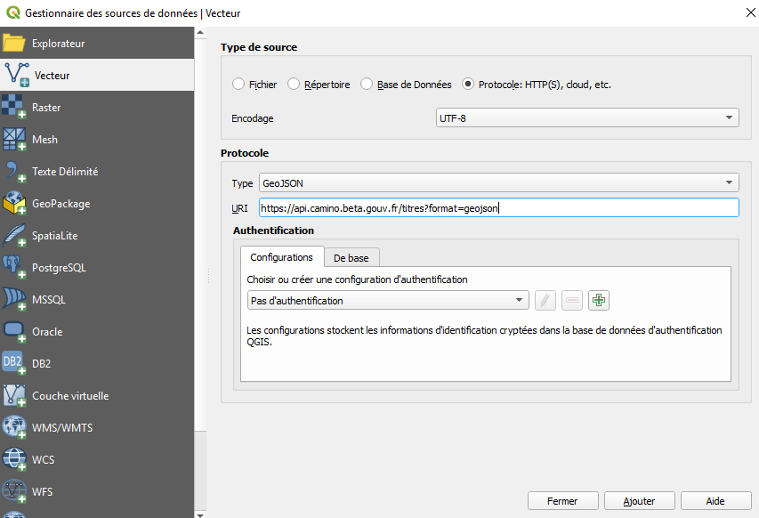
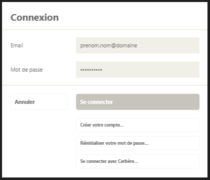
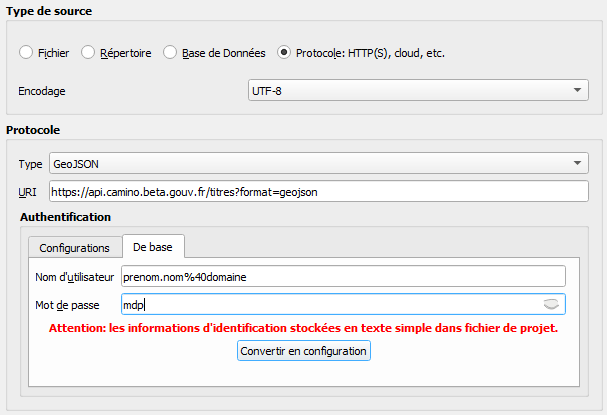
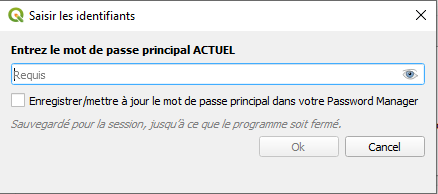
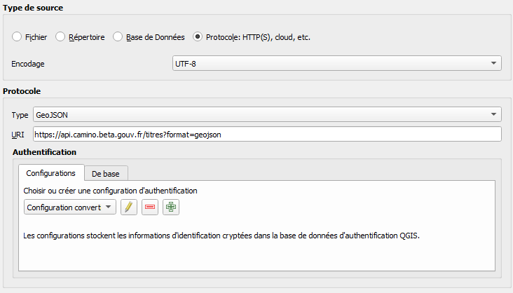
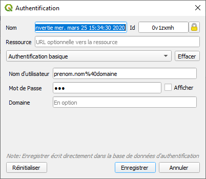
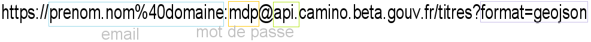
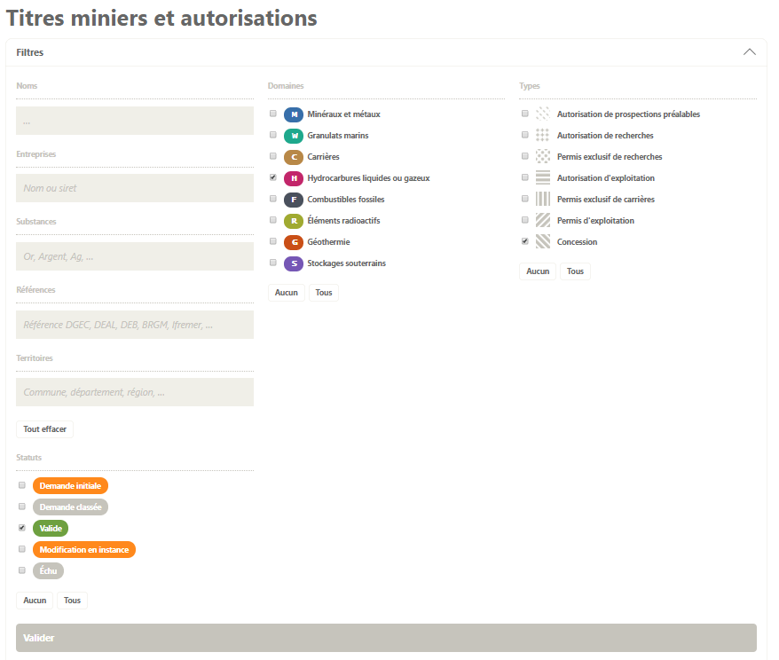
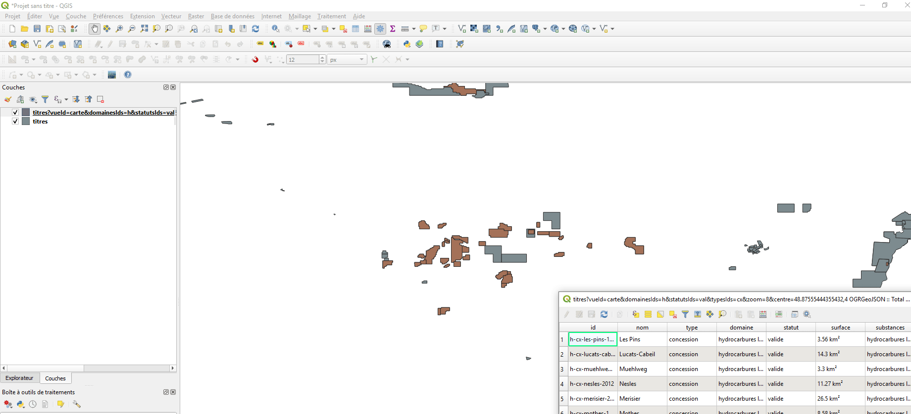

# Flux

Les flux géographiques de Camino fournissent au format geojson les données spatiales des périmètres des titres miniers ainsi que les données non spatiales suivantes :
- l'identifiant, le nom, le type, la nature (exploitation ou exploration) le domaine, et le statut du titre,
- la date de la demande, ainsi que les dates de début et de fin d'octroi,
- la surface (en km²) du périmètre du titre,
- les administrations concernées par le titre, ainsi que ses références,
- les titulaires et amodiataires, ainsi que leur n°siren
- l'engagement financier,
- les substances qui font l'objet du titre,
- le volume

## URL

L’url d'accès aux flux de camino est du type https://api.camino.beta.gouv.fr/titres?format=geojson
__format=geojson__ étant un paramètre obligatoire de la requête.

## Import de flux geojson dans QGIS

L'import et l'intégration de flux geojson dans un projet QGIS au travers de l'API les rend dynamique.
Ainsi, lors de la ré-ouverture du projet ou à chaque rafraîssement, les donnés de la couche concernée sont automatiquement mises à jour. 

### Import au travers du plugin camino-flux-QGIS

Camino dispose de son propre plugin permettant de façon simplifiée l'import et le chargement sous forme de couche dans QGIS des flux geojson.

Il est disponible pour les versions 3.x de QGIS.

Les informations d'installation et d'utilisation sont disponibles sur le lien github [https://github.com/MTES-MCT/camino-flux-QGIS](https://github.com/MTES-MCT/camino-flux-QGIS)

La documentation utilisateur au format pdf est disponible dans le plugin et également [ici](https://github.com/MTES-MCT/camino-flux-QGIS/blob/master/doc/camino_doc.pdf)

### Import hors plugin sans authentification

Le chargement s’effectue à partir du Gestionnaire des sources de données | Vecteur : 

- type de source : Protocole : HTTP(S), cloud, etc. 
- encodage : UTF-8
- Protocole :
  - Type : GeoJSON
  - URI : https://api.camino.beta.gouv.fr/titres?format=geojson

Sans authentification, l’import n’est possible que sur les flux publiques, c’est à dire ceux proposés par Camino hors connexion.

### Import hors plugin avec authentification

L’authentification permet un accès restreint à certains flux.
Les éléments d’authentification attendus sont ceux de la connexion à Camino, au détail près que le @ de l’email doit être remplacé par la chaine de caractère %40.

soit, dans cet exemple :
Email : prenom.nom%40domaine
Mot de passe : mdp

Sous QGIS, l’accès aux flux avec authentification est possible selon trois possibilités.

#### Authentification de base

Dans la partie Authentification du Gestionnaire des sources de données | Vecteur , onglet De base.

Saisir les éléments suivants :
Nom d’utilisateur : prenom.nom%40domaine
Mot de passe : mdp

#### Authentification par configuration

Depuis l’authentification De base, il est possible de choisir de Convertir en configuration.
Il faut cependant choisir un mot de passe, enregistré dans la base interne de QGIS, afin d’accéder à l’édition de la configuration.

La configuration ainsi créée, située dans l’onglet Configurations, porte le nom Configuration convertie le + la date de création.

Le nom est modifiable en éditant la configuration via le bouton 

Il est également possible de modifier les éléments d’authentification email et mot de passe.

Une configuration peut également être créée ex nihilo via la boîte de dialogue accessible par le bouton 

Les configurations sont supprimables via le bouton 

Le choix de l’utilisation d’une configuration se fait en sélectionnant cette configuration dans la liste déroulante. 
L’onglet Configuration est prioritaire sur l’onglet De base, c’est à dire que ce sont les éléments saisi dans la configuration qui seront utilisés dans le cas où les deux onglets sont remplis.

#### Authentification dans l’URI
Ce mode d’authentification est valable pour toutes les version de QGIS, mais est particulièrement utiles pour les versions antérieures à la 3.2 à partir de laquelle la partie Authentification est apparue dans le Gestionnaire des sources de données.

Pour l’utiliser, il suffit d’effectuer la procédure d’import classique en saisissant dans la partie URI la chaîne suivante :

Point d’attention :
- les __:__ entre l’email et le mot de passe
- le caractère __@__ après le mot de passe

### Import avec filtre
Il est possible d’ajouter des paramètres à l’URI afin de filtrer la requête et le geojson généré.
1. Effectuer une recherche filtrée à partir de Camino

2. Copier l’url ainsi mise à jour

https://camino.beta.gouv.fr/titres?vueId=carte&domainesIds=h&statutsIds=val&typesIds=cx&zoom=8&centre=48.87555444355432,4.246215820312501

3. Coller l’url dans la partie URI du Gestionnaire des sources de données | Vecteur de QGIS en ajoutant __api.__ devant camino, et __&format=geojson__ en bout de chaîne.
Il est également possible d'indiquer uniquement __?format=geojson__ juste après __/titres__ dans le cas où il n'y a aucun paramètre de sélectionné.

https://__api.__camino.beta.gouv.fr/titres?vueId=carte&domainesIds=h&statutsIds=val&typesIds=cx&zoom=8&centre=48.87555444355432,4.246215820312501&__format=geosjson__

ou

https://__api.__camino.beta.gouv.fr/titres?__format=geosjson__

L’utilisation des filtres et l'utilisation de l’authentification sont bien entendu cumulables.

### Sur le réseau interministériel de l'Etat (__RIE__)

Les éléments de configuration du le proxy sont :

  * Hôte : __pfrie-std.proxy.e2.rie.gouv.fr__
  * Port : __8080__
