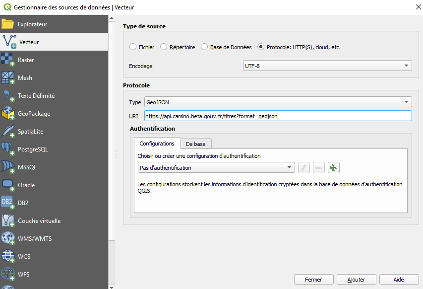

# Flux

Les flux geojsons sont exclusivement disponibles dynamiquement au travers de l'API

## Mode d'accessibilité

L’ensemble des flux geojson est accessible depuis l’url https://api.camino.beta.gouv.fr/titres?format=geojson

## Import de flux geojson depuis QGIS

### Import sans authentification

Le chargement s’effectue à partir du Gestionnaire des sources de données | Vecteur : 

- type de source : Protocole : HTTP(S), cloud, etc. 
- encodage : UTF-8
- Protocole :
-- Type : GeoJSON
-- URI : https://api.camino.beta.gouv.fr/titres?format=geojson

Sans authentification, l’import n’est possible que sur les flux publiques, c’est à dire ceux proposés par Camino hors connexion.

img

### Import avec authentification

L’authentification permet un accès restreint à certains flux.
Les éléments d’authentification attendus sont ceux de la connexion à Camino, au détail près que le @ de l’email doit être remplacé par la chaine de caractère %40.

img

soit, dans cet exemple :
Email : prenom.nom%40organisation
Mot de passe : mdp

Sous QGIS, l’accès aux flux avec authentification est possible de trois façons.

#### Authentification de base

Dans la partie Authentification du Gestionnaire des sources de données | Vecteur , onglet De base.

Saisir les éléments suivants :
Nom d’utilisateur : prenom.nom%40organisation
Mot de passe : mdp

img

#### Authentification par configuration

Depuis l’authentification De base, il est possible de choisir de Convertir en configuration.
Il faut cependant choisir un mot de passe, enregistré dans la base interne de QGIS, afin d’accéder à l’édition de la configuration.

img

La configuration ainsi créée, située dans l’onglet Configurations, porte le nom Configuration convertie le + la date de création.

img

Le nom est modifiable en éditant la configuration via le bouton
img

img

Il est également possible de modifier les éléments d’authentification email et mot de passe.

Une configuration peut également être créée ex nihilo via la boîte de dialogue accessible par le bouton 
img

Les configurations sont supprimables via le bouton 
img

Le choix de l’utilisation d’une configuration se fait en sélectionnant cette configuration dans la liste déroulante. 
L’onglet Configuration est prioritaire sur l’onglet De base, c’est à dire que ce sont les éléments saisi dans la configuration qui seront utilisés dans le cas où les deux onglets sont remplis.

#### Authentification dans l’URI
Ce mode d’authentification est valable pour toutes les version de QGIS, mais est particulièrement utiles pour les versions antérieures à la 3.2 à partir de laquelle la partie Authentification est apparue dans le Gestionnaire des sources de données.

Pour l’utiliser, il suffit d’effectuer la procédure d’import classique en saisissant dans la partie URI la chaîne suivante :
img

Point d’attention :
- les : entre l’email et le mot de passe
- le caractère @ (tel quel) après le mot de passe

### Import avec filtre
Il est possible d’ajouter des paramètres à l’URI afin de filtrer la requête et le geojson généré.
1. Effectuer une recherche filtrée à partir de Camino

img

2. Copier l’url ainsi mise à jour

https://camino.beta.gouv.fr/titres?vueId=carte&domainesIds=h&statutsIds=val&typesIds=cx&zoom=8&centre=48.87555444355432,4.246215820312501

3. Coller l’url dans la partie URI du Gestionnaire des sources de données | Vecteur de QGIS en ajoutant api. devant camino, et à la fin &format=geojson ou ?format=geojson selon qu’il existe d’autres paramètres dans l’url ou non.

https://api.camino.beta.gouv.fr/titres?vueId=carte&domainesIds=h&statutsIds=val&typesIds=cx&zoom=8&centre=48.87555444355432,4.246215820312501&format=geosjson

ou

https://api.camino.beta.gouv.fr/titres?format=geosjson

img

L’utilisation des filtres et l'utilisation de l’authentification sont cumulables.